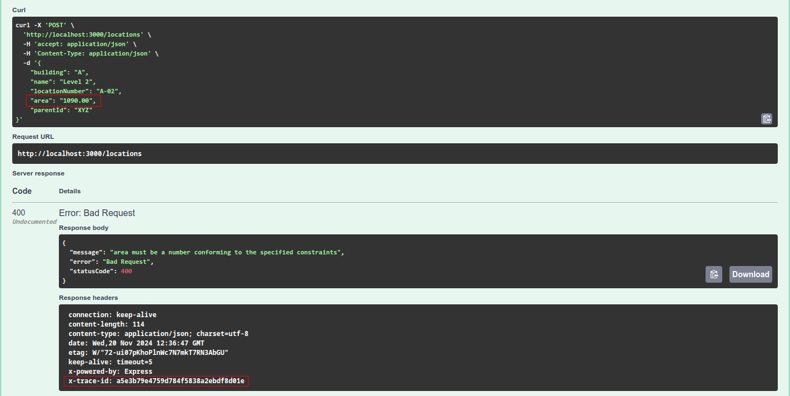
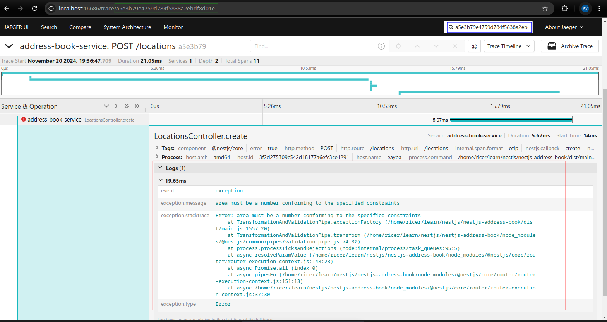

# Project Overview

## How to Run the Project

- **Development Environment**: Ensure the development environment is set up by running:
  ```bash
  docker-compose -f dev/docker-compose.dev.yml up -d
  ```
- **Database Migrations**: Migrate the database using:
  ```bash
  npm run applymigrations
  ```
- **Start the Application**: After applying migrations, start the application with:
  ```bash
  npm run start
  ```

## Building the Docker Image

- **Build Docker Image**: To build the Docker image using the `Dockerfile`, run:
  ```bash
  docker build -t address-book-api .
  ```

## Application Components

- **Tracer with OpenTelemetry**: Integrates OpenTelemetry for distributed tracing.
  - **Overview**: OpenTelemetry is used to collect and visualize trace data, which helps in monitoring and debugging the application.
  - **Trace ID Request with Error**: The image below shows how a trace ID is generated and associated with a request that encounters an error.
    
  - **Visualize Trace ID Info with Logs**: This image demonstrates how trace IDs are visualized alongside logs, providing a comprehensive view of the application's behavior.
    
- **Logging with Pino**: Utilizes Pino for efficient logging.
- **Configuration**: Supports merging process environment variables using `__` as a separator.
- **TypeORM DataSources**: Simplified settings for data sources with enhanced configuration.
- **Database Migrations**: Utility for generating database migrations, applying migrations, and reverting migrations.
- **Authentication**: Easily declare authentication chains in parallel or sequentially, with support for mapping the current user after successful authentication.
- **Validation Pipes**: Supports data transformation and normalization, such as converting to boolean or Date types, while ensuring input data validation.
- **Exception Handlers**: Standardizes error objects returned from HTTP responses.
- **Audit-Logging Infrastructure**: Allows setting creator, creationTime, lastModifier, lastModificationTime, deleter, and deletionTime, as well as tracking entity property changes.
